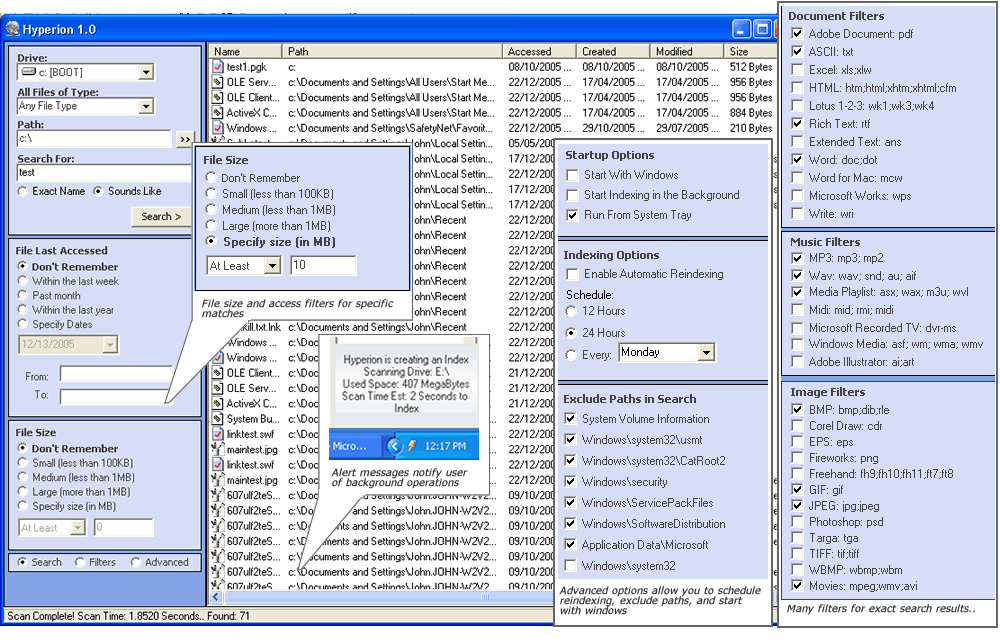



## Hyperion\! Open Source Desktop Search Engine

### Description

My first rev of this desktop search engine. Features include extermely fast file searches (often less then a second), music/document/image filters, file type filters, access and file size filters etc. Code includes Achilles 1.5 MTSE with many improvements in speed and functionality, also my Lightning 1.4 registry class. Examples of building a binary file dump with copymemory api, hacking a collection object from memory, using the wmi scripting object, multi threading, and much, much more.. If you think this is good, or you wanna use it, then all I ask is that you take the time to vote.. Cheers John
 
### More Info
 

             |
---                |---
**Submitted On**   |2005-12-22 17:46:44
**By**             |[Steppenwolfe](https://github.com/Planet-Source-Code/PSCIndex/blob/master/ByAuthor/steppenwolfe.md)
**Level**          |Intermediate
**User Rating**    |5.0 (95 globes from 19 users)
**Compatibility**  |VB 5\.0, VB 6\.0
**Category**       |[Complete Applications](https://github.com/Planet-Source-Code/PSCIndex/blob/master/ByCategory/complete-applications__1-27.md)
**World**          |[Visual Basic](https://github.com/Planet-Source-Code/PSCIndex/blob/master/ByWorld/visual-basic.md)
**Archive File**   |[Hyperion\!\_19590612222005\.zip](https://github.com/Planet-Source-Code/steppenwolfe-hyperion-open-source-desktop-search-engine__1-63763/archive/master.zip)

